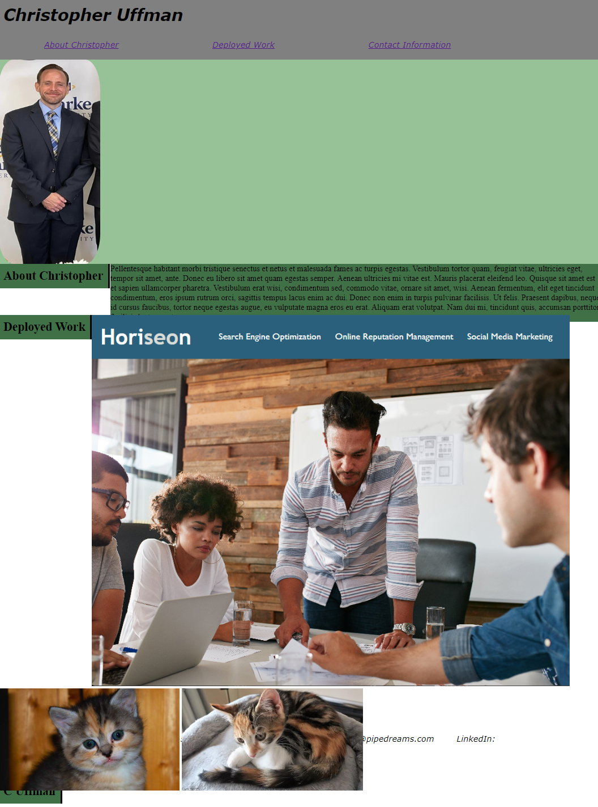

# Challenge_Module_02

## Description

-This project aimed to create a portfolio page for a prospective web developer.

-The portfolio page needs to provide the developer's name, a recent photo, links to sections about the developer, links to their work, and contact information.

-The navigation links for the bio, published applications, and contact shall all link to the appropriate sections when clicked by the viewer.

-When viewing the developer's published work, the first application appears in a clickable image that is larger than the other application images.

-Layouts are reformated using media queries to respond to breakpoints at 992 and 768 pixels.

## Usage

https://anuffisenough.github.io/Challenge_Module_2/

### Screenshot 

## Credits

![Mdn web docs tutorial on CSS Layouts and Flexbox] https://developer.mozilla.org/en-US/docs/Learn/CSS/CSS_layout/Flexbox

